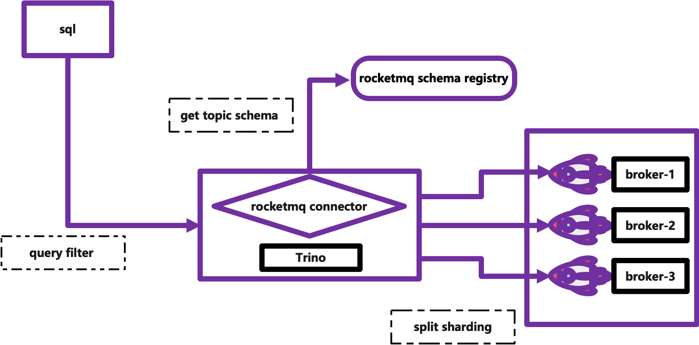

# Trino on RocketMQ
[](https://www.apache.org/licenses/LICENSE-2.0.html)

Trino:  [文档中心](https://trino.io/)

RocketMQ:  [文档中心](https://rocketmq.apache.org/)
# 架构介绍
>扩展 trino rocketmq connector，用于支持 rocketmq 下面的即席查询


# 快速开始(基于docker)
## 环境准备
> [ 1.] Linux/Unix/Mac
> 
> [ 2.] 64bit JDK 17
> 
> [ 3.] RocketMQ搭建 ，具体参考 [RocketMQ环境搭建](https://rocketmq.apache.org/docs/%E5%BF%AB%E9%80%9F%E5%85%A5%E9%97%A8/02quickstart)
>
> [ 4.] Docker镜像运行环境

## 下载docker镜像
```
docker pull trinodb/trino 
```
## 编译打包

```
git clone git@github.com:sunxiaojian/trino-rocketmq.git

cd trino-rocketmq/
 
mvn clean package -Dmaven.test.skip=true
```
## 配置目录

#### 准备配置目录
```
mkdir $PWD/trino
mkdir $PWD/trino/etc
mkdir $PWD/trino/plugin
mkdir $PWD/trino/plugin/rocketmq
```
#### 准备插件
将之前编译好的插件copy到rocketmq插件目录下面 
```
mv target/trino-rocketmq-397/* $PWD/trino/plugin/rocketmq
mv target/trino-rocketmq-397.jar $PWD/trino/plugin/rocketmq
```
#### 增加配置
**配置文件存放在 $PWD/trino/etc 路径下**
> 参考配置 [catalog](https://github.com/sunxiaojian/trino-rocketmq/tree/main/config)

## 启动

```
 docker run --name trino -d
            -p 8080:8080    ## 访问端口
            -p 5005:5005    ## 开启debug
            --volume $PWD/trino/etc:/etc/trino   ## 配置挂载目录
            --volume $PWD/trino/plugin:/usr/lib/trino/plugin  ## 插件挂载目录
            trinodb/trino  
```

## 测试
```
docker exec -it trino trino --catalog rocketmq --schema default
trino:default> show tables;
  Table
----------
 customer
(1 row)

Query 20220930_071816_00012_aem7m, FINISHED, 1 node
Splits: 7 total, 7 done (100.00%)
0.36 [1 rows, 25B] [2 rows/s, 70B/s]

trino:default> select * from customer;
 _queue_id | _queue_offset | _message | _message_length | _key | _key_length | _timestamp | _properties
-----------+---------------+----------+-----------------+------+-------------+------------+-------------
(0 rows)

Query 20220930_071847_00013_aem7m, FINISHED, 1 node
Splits: 8 total, 8 done (100.00%)
0.60 [0 rows, 0B] [0 rows/s, 0B/s]
```

## 基于 file schema 测试
```
 待支持
```
## 基于 rocketmq schema registry 测试

```
 待支持
```


